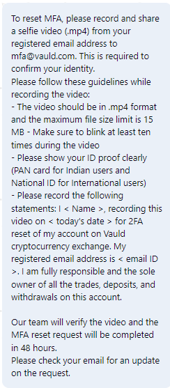

-
- 
- 10-150things for 300+ opportunities
- What is the orgs mission?
	- FL Mission Phil Purpose
		- Ford Motor to become a lean human centered organization
- ---
- Calling on dealers
- going after the after market
- 22yrs mid south market missisippi
- FCFD
- after market product
- gideon walter
- DFO LL2
- Ericson
- vehicle personalization
- new job
- 8billion 9%
- trying for 2 billion
- 4 weeks into sprint
- how might we get that
- Frederick Tony head of FCFD
- FCFD?
- Suzi's org
- Elena's Group
- both have some skin in the game
- this is about 3rd party
- ACE organization
- 3rd vs 1st
- Suzy probably would say she owns all customers in this space maybe all all
- direct to customer
- drop shop?
- customer vs 3rd party
- chemicals are the low hanging fruit
	- players will be eager to join market
- Was working with Hussien?
- Hussien left
- ---
- In remote world the shared vision/goal/phil even more important
- Really lean into things like miro to bring together
- What is it about miro
	- It's the catch all while still allowing for the specialized content repos where they make sense
- ---
- Stephen Graham
- Pivot or perseveer
- ---
- Newsie data used as how did the last 90 go?
- Could we build a summary view?
- Link Newsie to backstage?
- ---
- Newsie Product 90 check in
- Tiny MC editior?
- Ashley? was working on it
- Multiple branches?
- Feature flags?
- Roster? Link in the Newsie Product 90
- Is there an updated vision statement?
	- If not what would it be?
	- Like how has the goal changed from the original hey let's share what happened this week to...?
	- make it easy for prod teams to share progress
	- address the gap how leaders viewed the bigger projects
- Is there a healthy way for us to collab with Catalog and help both sides?
- Suzy/i Deering
- SRE
- In Ford Pro Tech or some group in newsie with Storefront
- Moble App discovery
- Help people expose interesting things from their backlog?
	- Integration to pull up last week of cards?
	-