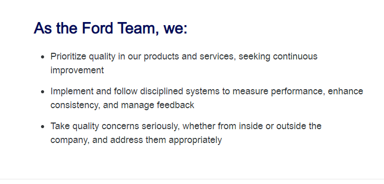

- Host SUp
- ---
- Allocations
- ---
- Chat with Elise and Brian around hiring experiment
	- RPA vs other procedures
		- What's the heart of the value?
			- It's not JAva or the algo so what is it?
				- Cause it's also not not the algo
					- Algo is providing a concrete set of things to eval
						- And yet coudln't we get similar data from helping them with the crud app?
- ---
- Work with Dorman's help to go through Promo in Life at Ford
- Talk with Amy around guidelines for remote work from alt location
- ---
- [[Learning Content Production]]
- ---
- Training certifications
	- 
	-